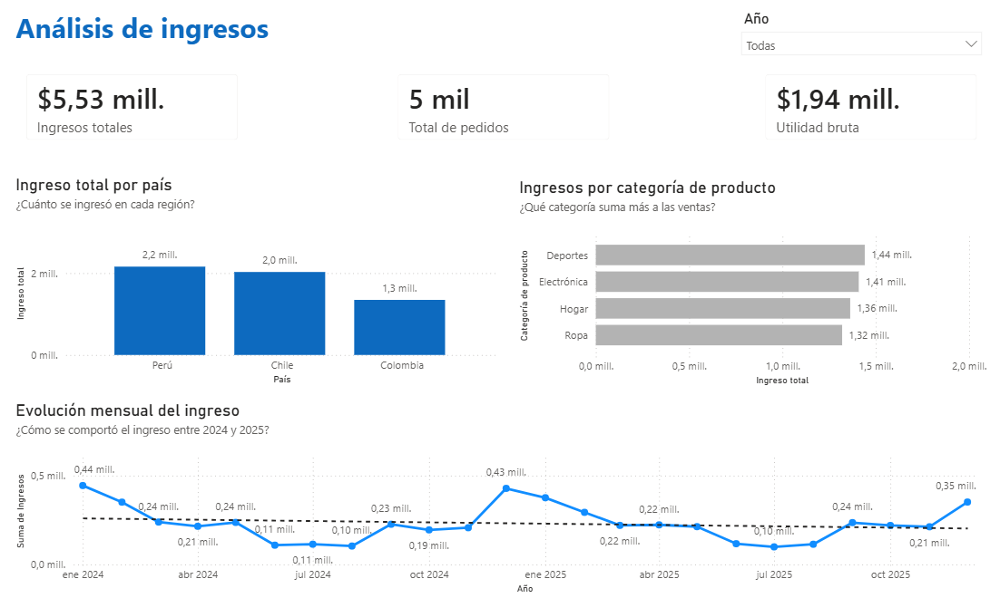
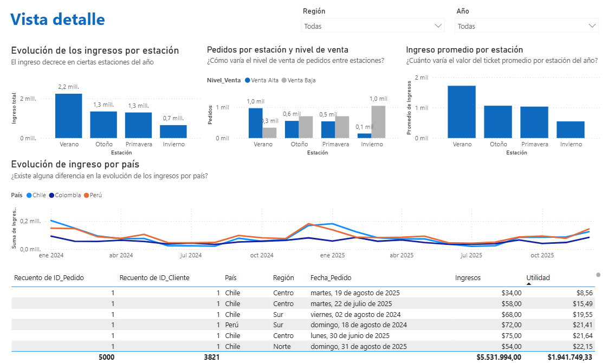

# Dashboard de Desempeño Comercial 2024–2025

Empresa: **Andes Retail Group**

Este repositorio contiene el dashboard de desempeño comercial desarrollado en Power BI durante el Sprint 10, con el objetivo de analizar la evolución de ingresos, pedidos y rentabilidad de la empresa durante 2024–2025.

## 📋 Descripción

El objetivo de este proyecto fue construir un dashboard ejecutivo que responda a la pregunta: **¿cómo ha evolucionado el ingreso total entre 2024 y 2025, y a qué se deben sus principales variaciones?**

Se utilizó un dataset de ventas con 12 columnas (numéricas, numéricas decimales, categóricas y de fecha), incluyendo `ID_Pedido`, `ID_Cliente`, `Segmento_Cliente`, `País`, `Región`, `Categoría_Producto`, `Fecha_Pedido`, `Precio_Unitario`, `Ingresos`, `Costo` y `Estación`. Como parte de la preparación de datos se corrigió el formato regional de fecha, se ajustó el tipo de dato de las columnas monetarias a decimal, y se creó la columna calculada `Nivel_Venta` (“Venta Alta” si `Ingresos` ≥ 1000, “Venta Baja” en caso contrario).

## 📊 Dashboard

🔗 [Ver dashboard interactivo en Power BI](https://app.powerbi.com/groups/me/reports/1a51b5a5-c77d-481a-80a6-b6b020541f47/13e843ad1110925b6610?experience=power-bi)

📁 Archivo fuente: [`dashboard/desempeno_comercial.pbix`](dashboard/desempeno_comercial.pbix)

## 🛠 Tech stack

- **Power BI Desktop / Power BI Service** — modelado de datos y visualización
- **Power Query** — limpieza y transformación (formato de fecha, tipos de dato, columna condicional)
- **DAX** — medidas de ingresos totales, utilidad bruta y ticket promedio

## 📊 Diccionario de datos

| Columna | Descripción |
|---|---|
| `ID_Pedido` | Identificador único de cada transacción |
| `ID_Cliente` | Identificador único del cliente |
| `Segmento_Cliente` | Segmento al que pertenece el cliente |
| `País` | País donde se realizó la venta |
| `Región` | Región geográfica del pedido |
| `Categoría_Producto` | Categoría del producto vendido |
| `Fecha_Pedido` | Fecha en la que se registró el pedido |
| `Estación` | Estación del año en la que ocurrió el pedido |
| `Precio_Unitario` | Precio unitario del producto (decimal) |
| `Ingresos` | Ingreso generado por el pedido (decimal) |
| `Costo` | Costo asociado al pedido |
| `Nivel_Venta` | Columna calculada: "Venta Alta" (Ingresos ≥ 1000) o "Venta Baja" |

## 🎨 Diseño del dashboard

**Vista Overview** — ¿Cómo ha evolucionado el ingreso total entre 2024 y 2025?
- KPIs: ingresos totales, total de pedidos, utilidad bruta
- Gráfico de líneas de evolución temporal del ingreso
- Comparativos por país/región, segmento de cliente y categoría de producto
- Filtro: Año

**Vista Detalle** — ¿Por qué han subido, bajado o se han mantenido los ingresos?
- Comparación estacional: ingresos, número de pedidos y ticket promedio por estación
- Evolución de ingresos por país (gráfico de líneas segmentado)
- Tabla detallada con conteo de pedidos, clientes únicos, país, región, fecha, ingresos y utilidad
- Filtros: Año, Región

## 🔑 Resultados clave

- El ingreso muestra un comportamiento cíclico a lo largo del año, con caídas claras en ciertos periodos.
- Al segmentar por estación, se identificó que la caída de ingresos ocurre de forma consistente durante el **invierno**.
- La causa principal **no es una menor cantidad de pedidos**, sino un **ticket promedio de compra significativamente más bajo** durante esa temporada.
- **Recomendación de negocio:** enfocar estrategias comerciales (promociones, upselling, bundles) en incrementar el valor del ticket promedio durante los meses de invierno, en lugar de esfuerzos orientados solo a captar más pedidos.

## ⚠️ Limitaciones

- El análisis cubre el periodo 2024–2025; los patrones estacionales identificados deberían validarse con datos de años adicionales antes de generalizarse.
- El dashboard no profundiza en las causas del menor ticket promedio en invierno (mix de producto, descuentos, etc.), lo cual queda como línea de análisis futura.

## 🚀 Próximos pasos

- Investigar los factores detrás del menor ticket promedio en invierno (categoría de producto, descuentos, comportamiento por segmento)
- Incorporar un análisis de rentabilidad por categoría de producto y segmento de cliente
